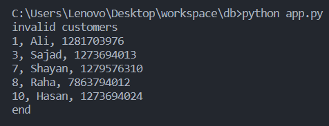

# database1_project

**You can keep up to date with the project by viewing the [Document.pdf](https://github.com/mhnasajpour/database1_project/blob/main/Document.pdf)**

## Configuration database

1- First create a postgresql database

2- Clone the project and enter the **[database](https://github.com/mhnasajpour/database1_project/blob/main/database)**

3- Run files **[tables.sql](https://github.com/mhnasajpour/database1_project/blob/main/database/tables.sql)**, **[insertion.sql](https://github.com/mhnasajpour/database1_project/blob/main/database/insertion.sql)**, **[trace_transaction.sql](https://github.com/mhnasajpour/database1_project/blob/main/database/trace_transaction.sql)**, **[validate_national_code.sql](https://github.com/mhnasajpour/database1_project/blob/main/database/validate_national_code.sql)** on the database in the order mentioned 

4- Run **[app.py](https://github.com/mhnasajpour/database1_project/blob/main/app.py)**

## Commands in app.py

### invalid customers

With this command, you can reach all invalid users in terms of national code

Format: **invalid customers**

### trace transaction

With this command, you can visually see all the transactions related to the target transaction

Format: **trace transaction [number of voucherid]**

Example: **trace transaction 5**

